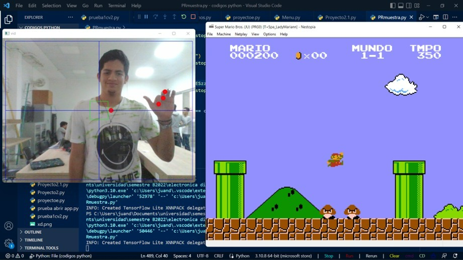

# 🎮 Game Body

**Game Body** es un innovador sistema que permite controlar videojuegos clásicos mediante gestos corporales. Utiliza visión por computadora para transformar los movimientos del cuerpo y las manos en comandos de teclado, brindando una experiencia de juego interactiva y sin necesidad de mandos físicos.
<p align="center">
  
</p>

---

## 🚀 Características

- Control de videojuegos clásicos (como Super Mario Bros, Street Fighter, Megaman) mediante gestos.
- Detección en tiempo real del cuerpo y la mano usando **MediaPipe**.
- Conversión de gestos a eventos de teclado simulados.
- Interfaz liviana, basada en Python y multiplataforma.

---

## 🧠 Tecnologías Utilizadas

- **Python**  
- **OpenCV**  
- **MediaPipe**  
- **PyAutoGUI**

---

## 游닞 쮺칩mo Funciona?

Game Body emplea la cámara del usuario para capturar en tiempo real los movimientos corporales. A través de los modelos de MediaPipe, se detectan las posiciones de manos y cuerpo, y luego se interpretan estos gestos para enviarlos como pulsaciones de teclado a los videojuegos.

### ✔️ Ejemplos de juegos compatibles:
- Super Mario Bros
- Street Fighter
- Megaman
- Y muchos más juegos clásicos que admiten entrada de teclado

---

## 🧰 Requisitos

Antes de ejecutar el proyecto, asegúrate de tener instaladas las siguientes bibliotecas:

```bash
pip install opencv-python mediapipe pyautogui
```
---

## 🚀 Ejecución
1. Clona el repositorio:

```bash
git clone https://github.com/judari09/gamebody.git
cd gamebody
```
2. Ejecuta el script principal:

```bash
python gamebody.py
```
3. Abre tu juego favorito y comienza a mover tu cuerpo para controlarlo. 🎮

